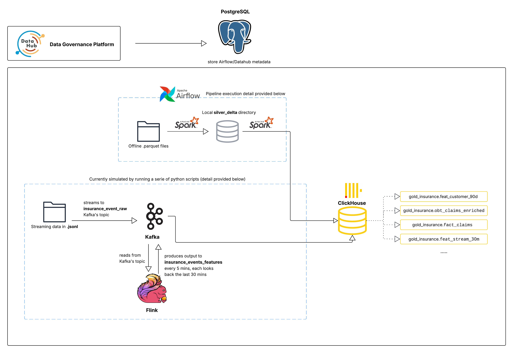
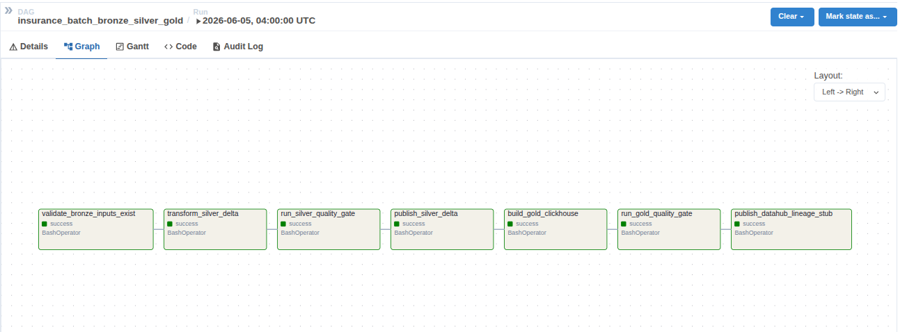

# Insurance Data + AI Engineering Project - Part 1

This imitates a small but production-style insurance data platform. It runs locally with
Docker Compose, but the architecture mirrors a real company: a lakehouse Silver
layer, a SQL Gold warehouse, quality gates, batch + streaming feature pipelines,
orchestration, and governance/lineage.

This document is structured to follow the 02 deliverable coverage: goal setup,
dimension/fact/OBT design, refresh & data quality, feature store, the full data
pipeline plan, and warehouse optimization. It describes **what is actually built
in this repo**, and is explicit about coursework simplifications.

---
## Table of contents

- [0. Project architecture](#0-project-architecture)
- [1. Goal setup](#1-goal-setup)
- [2. Known, intentional data issues the pipeline must handle](#2-known-intentional-data-issues-the-pipeline-must-handle)
  - [For offline data (Parquet)](#for-offline-datastored-in-parquet-format)
  - [For streaming data (JSONL)](#for-streaming-datastored-in-jsonl-format)
  - [Coursework simplifications](#coursework-simplifications-stated-up-front)
- [3. Processing jobs](#3-processing-jobs)
  - [Spark — batch processing](#spark---batch-processing)
  - [Flink — streaming data processing](#flink---streaming-data-processing)
- [4. Data storage (ClickHouse)](#4-data-storage)
- [5. Data pipeline orchestration (Airflow)](#5-data-pipeline-orchestration-airflow)
- [6. Data governance (DataHub)](#6-data-governance-datahub)
- [7. Data modeling design](#7-data-modeling-design)
- [8. Run locally](#8-run-locally)
- [9. Project structure](#9-project-structure)

---
## 0. Project architecture

## 1. Goal setup

**Objective.** Build a business-ready Gold zone for insurance analytics, BI, and ML
features, fed by trusted Silver lakehouse tables that are cleaned and quality-gated
from raw source data.

**Modeling approach.** Fact–Dimension (star schema) + One-Big-Table (OBT) +
offline/streaming feature tables.

**Naming conventions.** Gold database `gold_insurance`, with prefixes
`dim_`, `fact_`, `obt_`, `feat_`. Warehouse surrogate keys use the `_key` suffix
(SK); natural identifiers from source are business keys (BK).

**Layers / storage formats.**
- **Bronze** — raw generated source data preserved as-is. Offline tables as
  **Parquet**, streaming events as **JSONL**.
- **Silver** — cleaned, trusted tables as **Delta Lake** (transaction log, schema
  enforcement, time travel, safe overwrite).
- **Gold** — **ClickHouse** (`gold_insurance`), column-oriented OLAP, a better fit
  than PostgreSQL for read-heavy analytical/BI workloads. PostgreSQL is kept only
  for Airflow metadata and the DataHub backend.

**Input data profile.** Synthetic data generated by
`jobs/insurance_data_generator.py` (fixed seed = 42, reproducible):

| Source table | Volume | Key attributes |
|---|---|---|
| policyholders | 10,000 customers | customer_id, signup_ts, province, city, age, risk_segment, marketing_opt_in |
| policies | 15,000 policies | policy_id, customer_id, policy_type, start/end dates, premium_amount, policy_status |
| claims | ~2,700 distinct (incl. ~2% duplicate rows) | claim_id, policy_id, claim_date, claim_type, claim_amount, claim_status |
| payments | 30,000 attempts | payment_id, policy_id, payment_date, amount, payment_method, payment_status |
| streaming events | 35,926 events (1 day) | event_id, event_type, event_timestamp, created_ts, customer_id, policy_id, geo, channel, device |

## 2. Known, intentional data issues the pipeline must handle

Details found in `generated_insurance_data/quality_report.json`.

  ### For offline data(stored in .parquet format):
  - **Geography skew** — ~70% of customers in Quebec (drives Spark skew-join tuning).
  - **High Cardinality** —  `"customer_id_distinct_count": 10000`,`"policy_id_distinct_count": 15000`,`"claim_id_distinct_count": 2700`
  - **Duplicates** — ~2% duplicate claim rows; ~1.5% duplicate streaming event_ids.
  - **Schema evolution** — `risk_segment` and `payment_method` are null for records
    before `2025-10-01`. (SCD)

  ### For streaming data(stored in .jsonl format): 
  - **Duplicates** — ~3% duplicate event_id; Specifically, `"stream_duplicate_event_id_rate_pct": 2.95` & `"stream_event_count_including_duplicates": 35926`
  - **Streaming bursts** — 10× traffic in 08:00–08:20 and 20:00–20:20 windows.
  - **Late arrivals** — ~12% of events arrive 5–45 minutes after the event time. Specifically `"stream_late_arrival_rate_pct": 11.91`

  ### **coursework simplifications (stated up front):**
  - The generator is the source system and is run **manually once** before the
    pipeline; it is intentionally **not** part of the Airflow DAG.
  - Silver and most Gold tables use **full overwrite** rebuilds (idempotent)
    rather than incremental merge/upsert — justified by the small, deterministic
    dataset. The exception is `dim_customer`, which is an **SCD Type 2** merge
    target (see below) so its version history survives across runs.
  - `dim_policy` remains **Type-1 (overwrite)**; the same SCD2 pattern used for
    `dim_customer` could be applied to it if policy-attribute history were needed.

---
## 3. Processing jobs
### Spark - batch processing  
Detail doc: [Spark jobs to handle offline data problems ](docs/spark_optimization.md)

### Flink - streaming data processing
Detail doc: [Flink job to handle streaming data problems ](docs/flink_optimization.md)

## 4. Data Storage
ClickHouse - detail doc: [ClickHouse storage-layer optimization ](docs/clickhouse_optimization.md)

## 5. Data Pipeline Orchestration (Airflow)

The DAG pipeline is orchestrated by `dags/insurance_batch_pipeline.py`



For the sake of simplicity, data in this project at all layers is stored locally. 


- **Bronze:** raw source files preserved as Parquet; `validate_bronze_inputs_exist`
  confirms all files exist before processing.
- **Silver (lakehouse, Delta):** type cast/standardize, filter null keys, drop invalid
  (negative) measures, dedup by business key, and add ingest metadata
  (`ingest_ts`, `source_system`, `batch_id`, `ingest_year/month/day`). Written to
  `silver_delta_staging`, validated by the Silver gate, then **published**
  (overwrite) to trusted `silver_delta` partitioned by ingest date.
- **Gold (ClickHouse):** dims, facts, OBT, and `feat_customer_90d`.

## 6. Data Governance (DataHub)

Data Governance is also implemented using DataHub. 

It helps 
  - track the lineage of our data assets, and answers some questions such as: what are the steps taken to have a given data asset(.parquet file, a table in ClickHouse), or at a given step, what are the resulting data asset?
  - for a given data asset, it also ensures data quality by displaying the expectations about data reliability. 

Detail doc: [Data Governance with DataHub ](docs/datahub.md)

- View in the DataHub UI (`http://localhost:9002`)

---

## 7. Data modeling design

Detail doc: [Data Modeling with beaverDB demo](docs/data_modeling.md)

---

## 8. Run locally

```bash
docker compose up -d
# One-time source data (run from a Python env with pandas/numpy/pyarrow):
python jobs/insurance_data_generator.py
```

**Batch:** trigger the DAG `insurance_batch_bronze_silver_gold` from the Airflow UI
(manual trigger).

**Streaming (in order):**
```bash
docker exec insurance_airflow_scheduler python /opt/airflow/jobs/stream_json_to_kafka.py
docker exec insurance_airflow_scheduler python /opt/airflow/jobs/verify_kafka_topic.py
docker exec insurance_flink_jobmanager bash /opt/flink/usrlib/run_flink_stream_job.sh
docker exec insurance_airflow_scheduler python /opt/airflow/jobs/stream_features_to_clickhouse.py
docker exec insurance_airflow_scheduler python /opt/airflow/jobs/publish_streaming_lineage.py
```

**Services / UIs**
- Airflow: `http://localhost:8080` (admin/admin)
- Flink UI: `http://localhost:8081`
- ClickHouse HTTP: `localhost:8123`, database `gold_insurance`
- DataHub: `http://localhost:9002`
- PostgreSQL (Airflow/DataHub metadata only): `localhost:5432`

## 9. Project structure

```text
insurance_ai_de_engineering_project/
├── README.md                         # This document — architecture, design, and run guide
├── docker-compose.yml                # All services: Airflow, Postgres, ClickHouse, Kafka, Flink, DataHub
├── dockerfile.airflow                # Custom Airflow image (adds Spark, Delta, project Python deps)
├── pyproject.toml                    # Python project metadata & dependencies (uv-managed)
├── uv.lock                           # Pinned dependency lockfile for reproducible envs
├── main.py                           # Placeholder entrypoint (not part of the pipeline)
├── .env.example                      # Template for required env vars (copy to .env)
│
├── dags/
│   └── insurance_batch_pipeline.py   # Airflow DAG: validate Bronze → Silver → quality gate → Gold → gold gate → lineage
│
├── jobs/                             # All processing scripts run by the DAG or manually
│   ├── insurance_data_generator.py   # Source-system simulator: generates synthetic Bronze data (seed=42)
│   ├── silver_cleaning_delta.py      # Spark: Bronze Parquet → cleaned Silver Delta staging (AQE, skew-join, dedup)
│   ├── silver_quality_checks.py      # Silver gate: null keys, duplicate IDs, invalid measures — fails fast
│   ├── publish_silver_delta.py       # Promotes validated staging → trusted silver_delta (overwrite, partitioned)
│   ├── gold_clickhouse.py            # Spark: Silver Delta → Gold ClickHouse (dims, facts, OBT, SCD2 dim_customer, features)
│   ├── quality_checks_clickhouse.py  # Gold gate: BK uniqueness, FK availability, non-negative measures, feature ranges
│   ├── publish_datahub_lineage.py    # Registers batch dataset lineage (Bronze→Silver→Gold) in DataHub
│   ├── stream_json_to_kafka.py       # Replays generated JSONL events into Kafka topic insurance_events_raw
│   ├── verify_kafka_topic.py         # Streaming gate: confirms the raw topic exists and is non-empty
│   ├── stream_features_to_clickhouse.py  # Consumes Flink feature topic → ClickHouse feat_stream_30m
│   └── publish_streaming_lineage.py  # Registers streaming lineage (file→Kafka→Flink→Kafka→ClickHouse) in DataHub
│
├── flink/                            # Streaming feature-engineering job
│   ├── insurance_stream_features.sql # Flink SQL: event-time HOP-window aggregation over the raw topic
│   ├── run_flink_stream_job.sh       # Submits the SQL job to the cluster via the Flink SQL client
│   └── flink-sql-connector-kafka-3.2.0-1.18.jar  # Kafka connector JAR (committed so streaming works out of the box)
│
├── docs/                             # Deep-dive documentation referenced from this README
│   ├── spark_optimization.md         # Spark tuning for offline data problems (skew, cardinality, dedup, SCD)
│   ├── flink_optimization.md         # Flink streaming tuning (watermarks, late arrivals, bursts, shuffle)
│   ├── clickhouse_optimization.md    # ClickHouse storage-layer / OLAP optimization
│   ├── datahub.md                    # Data governance: batch & streaming lineage, quality expectations
│   └── data_modeling.md              # Star schema / OBT / SCD2 modeling design (with demo)
│
├── generated_insurance_data/         # Output of the data generator (gitignored, regenerable)
│   ├── generator_config.json         # Config/parameters the run was generated with
│   ├── offline/                      # Bronze offline sources as Parquet
│   │   ├── policyholders/            # part_old.parquet + part_new.parquet (drives schema evolution)
│   │   ├── policies.parquet
│   │   ├── claims.parquet            # Contains intentional ~2% duplicate rows
│   │   └── payments.parquet
│   ├── streaming/
│   │   └── insurance_events.jsonl    # Bronze streaming events (duplicates, bursts, late arrivals)
│   └── reports/
│       └── quality_report.json       # Documented, intentional data-quality issues in the generated data
│
├── assets/                           # Images embedded in the docs (architecture, DAG, lineage, benchmarks)
│   └── data_modeling/                # Data-modeling diagrams (star schema, SCD2, final tables)
│
├── silver_delta_staging/             # Candidate Silver Delta tables before the quality gate (gitignored, runtime)
├── silver_delta/                     # Trusted, published Silver Delta tables (gitignored, runtime)
├── gold/                             # Local Gold scratch/mount dir (gitignored, runtime)
├── datahub/                          # DataHub local runtime state (gitignored, runtime)
└── logs/                             # Airflow task logs (gitignored, runtime)
```

> **Note on runtime dirs.** `generated_insurance_data/`, `silver_delta*/`, `gold/`,
> `datahub/`, and `logs/` are gitignored. They are produced at runtime by the
> generator and the pipeline, and are fully regenerable — they are not committed.
