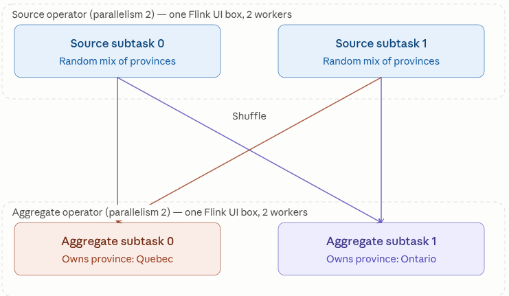
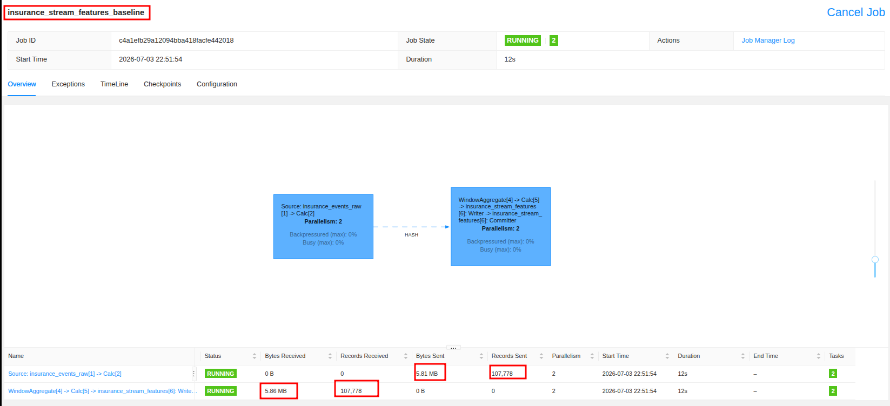
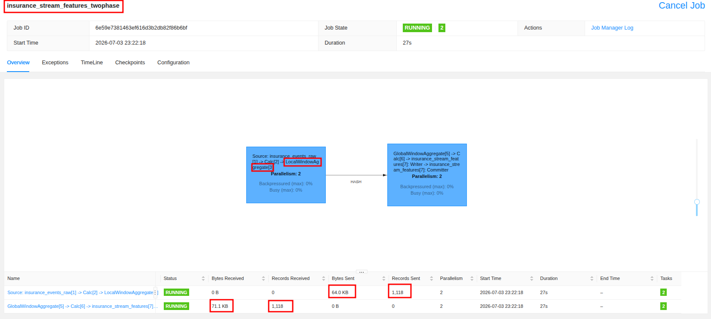

# Flink job to handle streaming data problems

## 1. Baseline without optimization (ONE_PHASE):

Flink streaming data processing is wrapped inside a .sql script. Every 5 minutes, Flink emits a new update to the `insurance_stream_features` table, every update looks back over the last 30 minutes using the code below:


```python
INSERT INTO insurance_stream_features
SELECT
  province,
  window_start,
  window_end,
  SUM(CASE WHEN event_type = 'quote_view' THEN 1 ELSE 0 END),
  SUM(CASE WHEN event_type = 'claim_submitted' THEN 1 ELSE 0 END),
  SUM(CASE WHEN event_type = 'payment_failed' THEN 1 ELSE 0 END),
  COUNT(*) >= 10 AS f_stream_burst_activity_flag
FROM TABLE(
  -- HOP creates rolling/sliding windows of 30 minutes that hop every 5 minutes, based on the event_timestamp field of the input data.
  -- So, Flink will create windows like:
  -- [12:00 - 12:30), [12:05 - 12:35), [12:10 - 12:40), etc.
  HOP(TABLE insurance_events_raw, DESCRIPTOR(event_timestamp), INTERVAL '5' MINUTE, INTERVAL '30' MINUTE)
)
GROUP BY province, window_start, window_end;
```
The query does `GROUP BY province` which is a skew column in which **70%** of clients come from Quebec. With ONEPHASE setting: 

```SQL
-- SET 'pipeline.name' = 'insurance_stream_features_baseline';
-- SET 'table.optimizer.agg-phase-strategy' = 'ONE_PHASE';
```

1. Every raw event read from Kafka gets a ``province`` key extracted 
2. Every single one of those events is immediately shuffled (by HASH dash arrow) to whichever subtask (`SET 'parallelism.default' = '2';`, thus we have 2 subtasks aka 2 Flink workers) owns that province's key group 



3. Only after arriving at the destination subtask does the "WindowAggregate" operator start accumulating the SUM/COUNT for that record
So the shuffle happens before any aggregation — every raw event, individually, travels across the network as its own record. That's why "Records Sent" equals our entire raw event count (107,778): nothing was combined before being sent.




## 2. With optimization TWO_PHASE


What happens in **TWO_PHASE**: 

1. Local aggregation first: each subtask runs a `LocalWindowsAggregate` locally before any shuffle. For each 5 minute micro-batch of the sliding window, it partially combines all records sharing the same `(province, window_start, window_end)` key it sees, and computing partial SUMs/COUNTs

2. Shuffle the partial results, not raw records: only the pre-aggregated partial results get sent across the network 

3. Global aggregation: the `GlobalWindowAggregate` on the receiving side merges the partial aggregates from all subtasks into the final SUM/COUNT per key

The result is records sent/received & bytes sent/receive drop from *~107k to ~1.1k* and *~5.86MB to ~64Kb* respectively.




## 3. Late arrival handling

The pipeline handles late-arriving events using Flink's watermark-based mechanism. Rather than closing a window the instant its end time passes, Flink waits until it has seen an event timestamped 5 minutes past that window's end before firing the aggregation. For example, an event A timestamped at 12:32. Watermark becomes 12:32 - 5 mins = 12:27, Window `[12:00-12:30]` is still open => event A gets included in this window. This creates a grace period: an event that arrives at the system late — because of network delay, client buffering, or upstream retries — but whose event_timestamp is still within 5 minutes of the current watermark, is still correctly included in its rightful window.

```sql
WATERMARK FOR event_timestamp AS event_timestamp - INTERVAL '5' MINUTE
```

*Limitation* Once the watermark has advanced more than 5 minutes past an event's timestamp, that event is silently dropped by the windowed aggregation. Flink's Table API does not currently expose a "late data" side-output like **DataStream API's** ``allowedLateness`` + ``sideOutputLateData`` (write a second sink like another Kafka topic so late events can be consumed in a seperate stream). This could be an improvement point in the future. 

## 4. Burst handling — already implemented, as a feature

```sql
COUNT(*) >= 10 AS f_stream_burst_activity_flag
```

for each `(province, window_start, window_end)` group, if 30 minutes contain 10+ events total, it flags `true`.